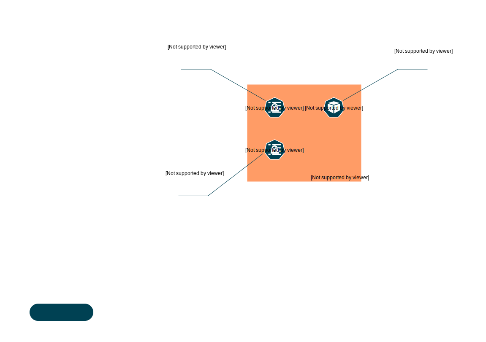

# Self Service Operators

This is a small collection of self service operators for Kubernetes. It's tailored to a setup where you want to enable people to use a Kubernetes-Cluster without the need to apply to a central authority if you want to deploy new apps.

## Self Service Project Operator

With this operator, you can enable users to create a namespace which they can administer themselves without providing them any read or write access to the rest of the cluster.

### What it does

The _only_ necessary RBAC-permissions users need is the right to create resources of type [project.selfservice.innoq.io](self-service-project-manifest.yaml). If a project-manifest gets applied, operator will create a namespace which gets pre-filled with Kubernetes resources (probably mainly service accounts RBAC roles & rolebindings) as configured. Additionally it'll craete a rolebinding to a configurable ClusterRole granting the owner of the project special permisssions _within this namespace_ (e.g. `admin`).




### Example scenario

We have a company test Kubernetes-Cluster where employees should be able to deploy apps in dedicated namespaces without the need to create a support ticket. Furthermore they should not have cluster-wide access to resources.

When an employee authenticates against Kubernetes, they belong to a group that has the permission to create a self-service project (more permissions are not needed):

```yaml
apiVersion: selfservice.innoq.io/v1
kind: Project
metadata:
  annotations:
    project.selfservice.innoq.io/argocd.project: copy
    project.selfservice.innoq.io/gitlabci-container-registry-secrets.public-key: skip
  name: sample-self-service-project
spec:
  owner: superdev@example.com
```

(ignore the annotations for now).

Once this resource is applied, the following happens:

- the owner of this project (`superdev@example.com`) has the right to update or delete the just created project resource
- a namespace with the project's name `sample-self-service-project` is created, the owner is the project resource
- the owner of the project gets the cluster-role `admin` (or a different role) for this namespace
- several other Kubernetes resources are created within the namespace (for example: RBAC permissions for other groups or users, etc.)

### Configuration

Yaml-representations of the resources that should be created in the new namespace must be stored in Kubernetes-Secrets. Each secret must have the annotation:

```yaml
project.selfservice.innoq.io/operator-access: grant
```

in order to be accessible to the operator. Each secret can store multiple items in it's data fields. Each item is addressed in the form:

```yaml
 project.selfservice.innoq.io/<secret-name>.<data-item-name>: copy # allowed values are 'copy' or 'skip'
```

If the value of the annotation is `copy`, this manifest will be applied in the new namespace. The operator can be configured with default manifests -- if a default manifest should be ommited, it's possible to explicitly set the value `skip` for this manifest.

If _all_ data items of a secret should be applied or skipped, simply omit the `<data-item-name>` part:

```yaml
project.selfservice.innoq.io/<secret-name>: copy # copy all data items of the secret
```

If a manifest yaml source contains the string`{{owner}}`, the occurence will be replaced by the value of the `owner` of the project. Likewise, occurences with `{{project}}` will be replaced by the project's / namespace's name.

Only namespaced resources are allowed -- cluster resources are forbidden.

The operator will apply the manifests addressed in the default manifests secret, followed by the manifests referenced in the annotations in listed order. Likewise, data items will be applied in the order they are stored in the secrets.

#### Example

On namespace creation, add a role binding that grants all users of the group `employees` the cluster role `view` within this namespace. Furthermore create a service account `viewer` which gets bound to the same cluster role:

```bash
# service account
kubectl create serviceaccount --dry-run=client -oyaml viewer > viewer-sa.yaml

# rolebinding (note the '{{project}}' placeholder)
kubectl create rolebinding --dry-run=client --clusterrole=view --serviceaccount="{{project}}:viewer" --group=employees -oyaml viewer-binding > viewer-binding.yaml

# save these two manifests in a secret for usage by the operator
kubectl create secret generic --from-file=viewer-sa=viewer-sa.yaml --from-file=viewer-bindings=viewer-binding.yaml -oyaml permissions

# set annotation to make this secret accessible to the operator
kubectl patch secret permissions -p '{"metadata":{"annotations": {"project.selfservice.innoq.io/operator-access":"grant"}}}'

```

In order to copy/skip manifests saved in this secret, set annotations like this in the project manifest:

```yaml
project.selfservice.innoq.io/permissions.viewer-bindings: copy

# this 'skip' statement is only necessary, if this manifest would be copied by default
project.selfservice.innoq.io/permisssion.view-sa: skip
```

Note, that the manifests are not limited to rolebindings and service accounts -- it's as well possible to apply a job that should run on namespace creation or to add a deployment, etc.
